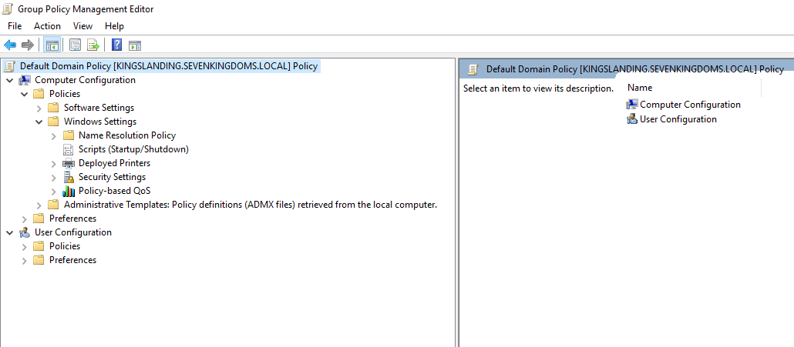

Desde la última y mayor actualización de Deep Hacking, todos los artículos están en formato Markdown y disponibles en el siguiente repositorio:

- [Repositorio de artículos](https://github.com/DeepHackingBlog/content)

El propósito de este artículo es mostrar el proceso a seguir para proponer artículos y, además, proporcionar algún consejo. Vamos por partes :)

- [¿Cualquier persona puede subir artículos?](#cualquier-persona-puede-subir-artículos)
- [¿Cómo propongo un artículo?](#cómo-propongo-un-artículo)
- [Formato del Markdown](#formato-del-markdown)
  - [Estilos para el Markdown](#estilos-para-el-markdown)
  - [Conclusión sobre Markdown](#conclusión-sobre-markdown)
- [Página de autor](#página-de-autor)
- [Subir tu artículo también en inglés](#subir-tu-artículo-también-en-inglés)
- [Proceso de subida](#proceso-de-subida)
- [Conclusión](#conclusión)

## ¿Cualquier persona puede subir artículos?

La respuesta corta es: sí… pero no de cualquier manera.

Deep Hacking se ha convertido en un proyecto comunitario, y precisamente esa apertura es lo que lo hace especial. Creemos firmemente que el conocimiento debe compartirse y que tanto perfiles junior como profesionales con años de experiencia pueden aportar muchísimo valor.

Sin embargo, un proyecto abierto también necesita criterios claros para no perder su esencia. Crecer en cantidad nunca puede significar bajar el nivel técnico, la claridad o la utilidad práctica del contenido.

Y esto no es solo teoría. Yo mismo he pasado por etapas en las que, casi sin darme cuenta, priorizaba publicar más en lugar de publicar mejor. Con el tiempo aprendí que la calidad siempre debe ir primero.

Por eso:

- ✅ Cualquier persona puede proponer un artículo.
- ❌ No cualquier contenido ni en cualquier formato será publicado.

Buscamos artículos que:

- Sean originales (o con derechos claros).
- Tengan un enfoque técnico y educativo.
- Aporten valor real y práctico.
- Y, sobre todo, encajen con la línea de Deep Hacking (aunque por supuesto, todo se puede hablar).

> ¡Por cierto! Compañeros de Blue Team, Ciberinteligencia y otras disciplinas defensivas: sabemos que el blog se llama Deep Hacking, pero también formáis parte de esto.

## ¿Cómo propongo un artículo?

Si quieres escribir en el blog, lo mejor es que envíes un correo explicando tu propuesta a:

- [juanantonio.gonzalezmena@deephacking.tech](mailto:juanantonio.gonzalezmena@deephacking.tech)

Para facilitar la revisión, puedes usar esta plantilla como base:

```text
Asunto: Propuesta de artículo – Deep Hacking

Nombre o pseudónimo:
- 

Título propuesto: 
- (Sugiere un título para el artículo)

Descripción: 
- (Describe brevemente de qué trata el artículo, qué quieres aportar con el mismo)

Experiencia sobre el tema:
- (Cuéntanos un poco sobre tu experiencia sobre el tema que quieres hablar. También puedes añadir brevemente experiencia laboral si lo consideras necesario)

Repositorio o recursos adicionales:
- (solo si aplica)

Redes sociales:
- (Te agradecemos si nos proporcionas tus enlaces a redes sociales, ya sea LinkedIn, Twitter o GitHub. Sobre todo LinkedIn)
```

Una vez que envíes el correo:

1. Revisaremos tu propuesta.
2. Te responderemos por correo tanto si es aceptada como si no.
3. Si se acepta, coordinaremos el Pull Request y la publicación.

> No te preocupes si no te respondo inmediatamente, después de 8 horas trabajando delante del ordenador, a veces descanso jeje.

## Formato del Markdown

El artículo deberá estar en formato Markdown e incluir obligatoriamente un frontmatter al inicio, es decir, un bloque de metadatos con información sobre el artículo. A continuación os dejo una plantilla:

```yaml
---
id: "<slug-del-articulo-en-minusculas-y-con-guiones>"
title: "<Título del artículo>"
author: "<usuario-github-o-slug-del-autor>"
publishedDate: YYYY-MM-DD
updatedDate: YYYY-MM-DD
image: "https://cdn.deephacking.tech/i/posts/<slug-del-articulo>/<imagen-principal>.webp"
description: "<Descripción breve y clara del contenido del artículo (150-160 caracteres recomendados)>"
categories:
  - "<categoria-principal>"
  # - "<categoria-secundaria>" (opcional)
draft: false
featured: false
lang: "es"
---
```

Por ejemplo, si haces un artículo que sea "Cómo subir un artículo en Deep Hacking", un frontmatter válido sería:

```yaml
---
id: "como-subir-un-articulo-a-deep-hacking"
title: "Cómo subir un artículo a Deep Hacking"
author: "juan-antonio-gonzalez-mena"
publishedDate: 2026-04-06
updatedDate: 2026-04-06
image: "./images/portada.png"
description: "Aprende cómo subir artículos a Deep Hacking. Desde la aprobación del artículo hasta el Pull Request"
categories:
  - "miscellaneous"
draft: false
featured: false
lang: "es"
---
```

Sobre algunos campos, tengo que comentar algún que otro detalle:

- `author`: colocarás tu nombre separado por guiones o nickname, según cómo prefieras presentarte. Este campo servirá también para crear tu página de autor, en caso de que quieras una (ver sección [Página de autor](#página-de-autor)).
- `publishedDate` y `updatedDate`: puedes poner una fecha futura entre semana. Si la fecha no cuadrase, no te preocupes, yo mismo me encargaría de cambiar los valores.
- `image`: sirve para representar la portada. Puedes dejarlo vacío con comillas dobles (`image: ""`), ya que me encargo yo de realizarla. Si tienes alguna idea para la portada, coméntamela.
- `categories`: especifica la categoría o categorías a las que pertenece tu artículo. Si son varias, añade un ítem por cada una. Puedes consultar las categorías disponibles en [categories.ts](https://github.com/DeepHackingBlog/content/blob/main/categories.ts) del repositorio.
- `lang`: indica el idioma del artículo: `es` para español o `en` para inglés. Sobre la publicación en inglés hablaremos más adelante (ver sección [Subir tu artículo también en inglés](#subir-tu-artículo-también-en-inglés)).

Para finalizar, el nombre del archivo Markdown del artículo normalmente será su título en minúsculas separado con guiones, por ejemplo:

- `como-subir-un-articulo-a-deep-hacking.md`

Esto será así siempre y cuando el nombre del archivo no quede demasiado largo. En tal caso, deberás poner un nombre mas corto con las palabras claves.

### Estilos para el Markdown

#### Colocar 2 imágenes en 2 columnas

Si tenéis, por ejemplo, 2 imágenes verticales o simplemente 2 imágenes que queréis colocar una al lado de otra, podéis usar los siguientes tags HTML:

```markdown
<div class="grid grid-cols-2 gap-4">
<div>


</div>
<div>


</div>
</div>
```

Ejemplos de esto los podéis ver en los artículos de dispositivos móviles. Consultad el artículo en el blog y mirad su archivo en el repositorio para ver cómo es.

#### Colocar leyendas en imágenes

Si queréis colocar leyendas debajo de las imágenes, podéis hacerlo de la siguiente manera:

```markdown
<figure>


<figcaption>

Texto de la leyenda

</figcaption>

</figure>
```

### Conclusión sobre Markdown

El mejor resumen que os puedo dar de esta parte es que tenéis más de 100 ejemplos de los más de 100 artículos que hay en el blog. Si tenéis duda de cómo hacer algo que habéis visto en otro artículo o simplemente tenéis dudas del formato, podéis consultar [el repositorio de contenido de Deep Hacking](https://github.com/DeepHackingBlog/content) y ver todos los ejemplos. Usad el buscador de GitHub y colocad alguno de los tags HTML, así podéis ver ejemplos directos.

En todo caso, si tenéis dudas podéis preguntármelas, ya sea a través del correo electrónico o el servidor de Discord.

## Página de autor

Vale, supongamos que ya tenemos hecho el artículo en Markdown. Ahora toca, opcionalmente, crear la página de autor. La página de autor consiste en que tu nombre, cuando aparezca como autor de un artículo, sea un enlace pulsable que lleve a tu perfil. Por ejemplo, mi página de autor la podéis ver en el siguiente enlace:

- [Página de autor de Juan Antonio González Mena](https://blog.deephacking.tech/es/author/juan-antonio-gonzalez-mena/)

Como podéis ver, la página de autor sirve para mostrar:

- Contribuciones al blog
- Redes sociales

Además, se complementa con el [Salón de la Fama](https://blog.deephacking.tech/es/hall-of-fame/): si tienes una página de autor, también aparecerás ahí junto a las redes sociales que hayas incluido.

Para crearla, necesitarás un archivo Markdown con la siguiente estructura:

```markdown
---
name: "<Nombre completo>"
bio: "<Breve descripción profesional (1 línea)>"
avatar: "<URL del avatar o imagen de perfil (512x512 recomendado)>"
website: "<https://tu-web.com/>" # opcional
github: "<https://github.com/usuario>" # opcional
twitter: "<https://twitter.com/usuario>" # opcional
linkedin: "<https://www.linkedin.com/in/usuario/>" # opcional
lang: "es"
---

¡Hola! 👋 Soy **<Nombre completo>**, también conocido/a como **<nickname si aplica>**.

Actualmente me dedico a <especialidad o rol principal> y tengo experiencia en <áreas técnicas principales>.

Mi interés principal dentro de la ciberseguridad es <red team / blue team / pentesting web / malware / cloud / etc.>, aunque también disfruto trabajando en <otras áreas si aplica>.

Creo firmemente en compartir conocimiento y aportar a la comunidad, por eso participo en Deep Hacking.

Si quieres contactar conmigo o seguir mi trabajo, puedes hacerlo a través de mis redes sociales.
```

Lo más importante para que tus artículos se conecten con la página de autor es que el valor del campo `author` del frontmatter del artículo coincida exactamente con el nombre del archivo Markdown de tu página de autor. Por ejemplo, si en tu artículo tienes:

```markdown
author: "juan-antonio-gonzalez-mena"
```

Entonces tu archivo de autor deberá llamarse:

- `juan-antonio-gonzalez-mena.md`

De esta manera, todos tus artículos quedarán vinculados a tu página de autor.

Sobre la plantilla, hay que decir que todos los campos son opcionales excepto `name`, que es el que permite mostrar tu nombre o nickname en el blog. La descripción que va debajo del frontmatter también es opcional.

Un ejemplo de frontmatter válido sería el siguiente:

```markdown
---
name: "Juan Antonio González Mena"
bio: "Creador de Deep Hacking"
avatar: "https://0.gravatar.com/avatar/44f72985d93c8c7c19a2cc9ecda6cd41e47a2a743ce0a3c7101c2527db9cb65e?size=512&d=initials"
website: "https://blog.deephacking.tech/"
github: "https://github.com/sikumy"
twitter: "https://twitter.com/sikumy"
linkedin: "https://www.linkedin.com/in/juanantonio-gonzalez/"
lang: "es"
---

Holaaa 👋. Soy **Juan Antonio González Mena**, aunque muchos me conocen como **Sikumy**. Tengo 24 años y llevo más de cuatro años trabajando en el mundo de la ciberseguridad. También soy el creador de este blog que estás leyendo.

Deep Hacking nació como unos simples apuntes personales. Con el tiempo fue creciendo, evolucionando y, con sus etapas buenas y malas, se ha convertido en lo que es hoy: **un espacio creado por y para la comunidad**.

No sé hasta dónde llegará este proyecto ni qué caminos recorrerá, pero sí tengo claro que mi objetivo es que se convierta en una referencia técnica. El tiempo dirá. Mientras tanto, me encantaría que me acompañaras en este viaje.
```

Al igual que con los artículos, puedes consultar en la [carpeta de autores de Deep Hacking](https://github.com/DeepHackingBlog/content/tree/1f59b5a6b92fdb7d52623374ab2c482a8df750bc/authors) todos los ejemplos de todos los autores si tienes dudas.

Por último, tanto para los artículos como para los autores, puedes consultar todos los campos disponibles y si son obligatorios u opcionales en el archivo [config.ts](https://github.com/DeepHackingBlog/content/blob/1f59b5a6b92fdb7d52623374ab2c482a8df750bc/config.ts) del repositorio.

## Subir tu artículo también en inglés

Lo genial de la última actualización de Deep Hacking es que el blog está disponible tanto en español como en inglés, por lo que es posible llegar a más gente en ambos idiomas.

Para publicar un artículo en inglés, hay que tener en cuenta lo siguiente:

- Para los artículos:
  - Traducir el nombre del archivo Markdown al inglés. Por ejemplo: `how-to-submit-an-article-to-deep-hacking.md`.
  - En el frontmatter, cambiar el valor del campo `lang` de `es` a `en`.
  - El campo `id` del frontmatter **no se traduce**; se deja exactamente igual en ambas versiones.
  - Traducir el contenido del artículo.

- Para los autores:
  - Mantener el mismo nombre de archivo en ambos idiomas.
  - Traducir el campo `bio` del frontmatter.
  - Traducir la descripción que va debajo del frontmatter, si la hay.

Para todas estas tareas, tengo prompts ya escritos que las automatizan. Recomiendo que los ejecutéis para revisar que todo esté bien. Podéis consultar el siguiente repositorio:

- [Repositorio de Prompts](https://github.com/DeepHackingBlog/ai-prompts)

Podéis ejecutarlo con VSCode y Copilot o la herramienta que prefiráis.

> Importante: Se recomienda encarecidamente ejecutar estos prompts únicamente después de haber movido el artículo al repositorio `content` clonado. Podéis ver las recomendaciones en el `README.md` del repositorio.

## Proceso de subida

Después de todo lo anterior, el proceso de subida es relativamente sencillo: se trata de hacer un Pull Request al repositorio de contenido. A continuación os explico los archivos que deberíais subir y los pasos exactos a seguir.

Si, por ejemplo, vais a subir un artículo tanto en español como en inglés, junto a otros dos archivos de la página de autor (español e inglés), los archivos y rutas que deberéis subir serían los siguientes:

```text
/content/posts/es/articulo.md
/content/posts/en/post.md
/content/authors/es/autor.md
/content/authors/en/author.md
```

Las imágenes de los artículos deberán estar alojadas en una de las dos carpetas donde se suben las dos versiones del artículo, y deberá llamarse `images`. Por ejemplo:

```text
/content/posts/es/images/
```

Cada archivo Markdown hará referencia a las imágenes con rutas relativas (`./images/nombre.png`). Para la versión en inglés se usa exactamente la misma referencia, aunque la carpeta `images` físicamente solo exista dentro de la carpeta de la versión en español; el sistema se encarga del resto.

Los pasos a seguir son los siguientes:

1. Haz un fork del repositorio.



2. Una vez forkeado, clónalo:

```bash
git clone https://github.com/tu-usuario/content/
```

3. Añade los archivos Markdown y la carpeta de imágenes.

4. Ejecuta los siguientes comandos:

```bash
git add .
git status
```

Al hacer el `git status`, los archivos que deberán aparecer como rastreados serán los siguientes (ejemplo):

```text
/content/posts/es/articulo.md
/content/posts/es/images/image-1.png
/content/posts/es/images/image-2.png
/content/posts/en/post.md
/content/authors/es/autor.md
/content/authors/en/author.md
```

5. Después de verificar que todo esté bien, haz el commit. Recomiendo que el nombre sea el título del artículo:

```bash
git commit -m "Como subir un articulo a Deep Hacking"
```

6. Sube los cambios a tu fork:

```bash
git push -u origin main
```

7. Por último, ve a tu fork en GitHub. Verás un banner con el botón **"Compare & pull request"**. Haz clic en él, escribe una breve descripción de qué incluye tu PR y envíalo.

> Desde ese momento revisaré el Pull Request, te dejaré comentarios si hay algo que ajustar y, una vez todo esté correcto, lo fusionaré con la rama principal y el artículo quedará preparado para publicarse.

## Conclusión

Espero que este artículo haya despejado todas las dudas sobre cómo contribuir al blog. El proceso, resumido, es tan sencillo como esto:

1. **Propón tu artículo** por correo antes de ponerte a escribir.
2. **Redáctalo** siguiendo el formato Markdown con su frontmatter.
3. **Crea tu página de autor** si quieres aparecer en el Salón de la Fama.
4. **Tradúcelo al inglés** si quieres llegar a más gente.
5. **Haz el Pull Request** con todos los archivos.

No hace falta ser un experto en Git ni en Markdown para contribuir. Si en algún paso te atascas, escríbeme por correo o pasa por el servidor de Discord y lo resolvemos juntos. La comunidad es lo primero.

Y por supuesto, si crees que algún paso de este artículo es poco claro o mejorable, comentamelo. Al final yo tengo asumido el proceso completo y he intentado explicarlo lo mejor posible para alguien que no está familiarizado.